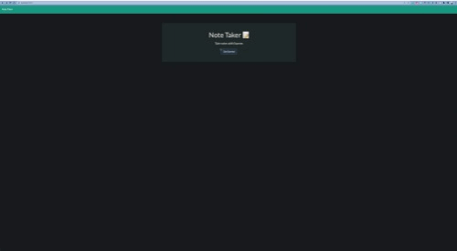
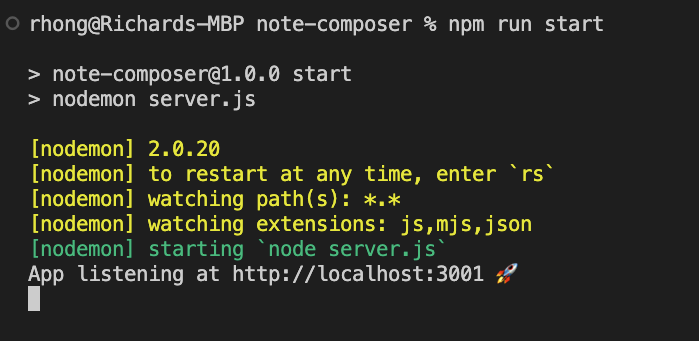
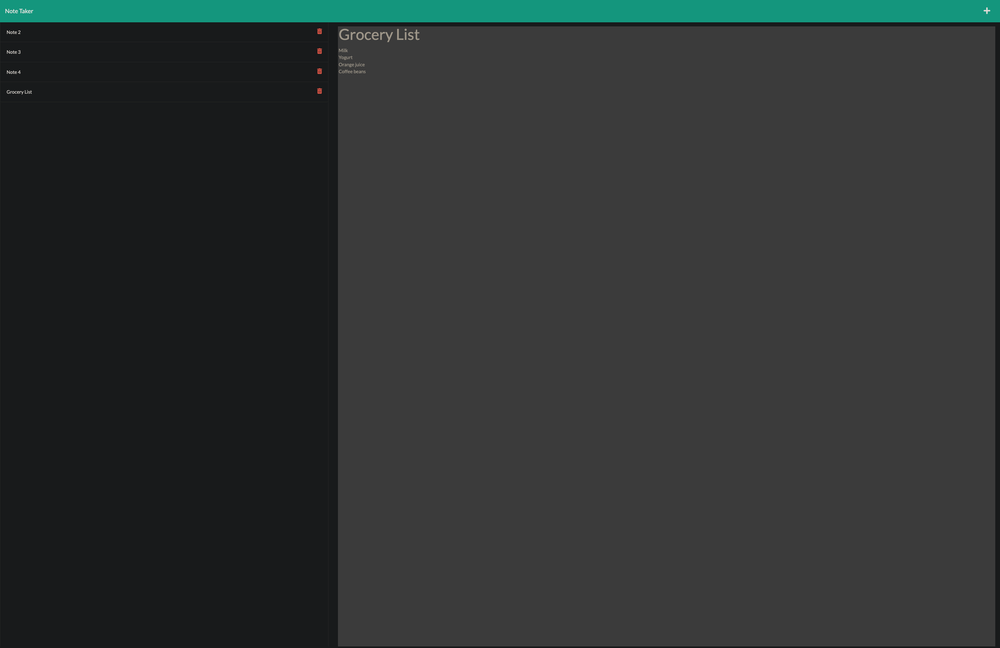

# Note Composer

[](https://opensource.org/licenses/MIT)




## Description
This app takes user input on the browser client and via the back end (Node.js and Express.js), contextual HTML routes will create a new note, load an existing note, or delete an existing note. 


## Technologies
This app is built with [Node.js](https://nodejs.org/en/), Node.js' native [filesystem](https://nodejs.org/api/fs.html) module, [Express](https://expressjs.com/) npm module (version 8.2.4), and lastly [Nodemon](https://www.npmjs.com/package/nodemon) for convenience on restarting the node on fast iterative additions of code.


## Table of Contents
  - [Installation](#installation)
  - [Usage](#usage)
  - [Architecture](#architecture)
  - [Screenshot](#screenshot)
  - [Video Demo](#demo)
  - [License](#license)
  - [Improvements](#improvements)
  - [Questions](#questions)


## Installation

After cloning the repository, user should run the following command within the terminal:
```
npm install
```
Afterwards check towards the bottom within package.json; the user should see Express version 4.18.2 as a dependency and nodemon version 24.9.0 as a dependency.

```
...
  "dependencies": {
    "express": "^4.18.2",
    "nodemon": "^2.0.20"
  }
```

## Usage
After installing Express and nodemon, the user should run the following commands within the terminal:
```
npm run start
```
After running the command, the user should expect to see something similar within his/her terminal:



Next the user can navigate to the [home page](http://localhost:3001) (http://localhost:3001) of the app.

## Architecture
For this program, the front-end public folder was already created; however the back-end logic, components, and routes needed to completed and plugged into the front-end to create a cohesively working app. 

The back-end code uses server.js on the root level to start the server. Routes folder contains the router and performs the middleware and routing functions for retrieving notes from the mock database json, posting a new note, and deleting an existing note. Helpers contains more robust functionality built on filesystem's different methods of reading and writing to files. Lastly, uuid creates pseudo-random ids for any newly created note.

To tie both the front-end and back-end, a user interacts with the browser client and based on the interaction a specific route and request method are called. The server hosted locally then either retrieves data from the db.json file or creates new data and then writes to the db.json file. 


## Screenshot



## License
This app was licensed under the MIT License.


## Improvements
Creating unit tests to check each route would be beneficial to not have to manually use an API client such as Insomnia or Postman. 


## Questions
Questions, comments, concerns? Send me an email at rhong24@gmail.com.
